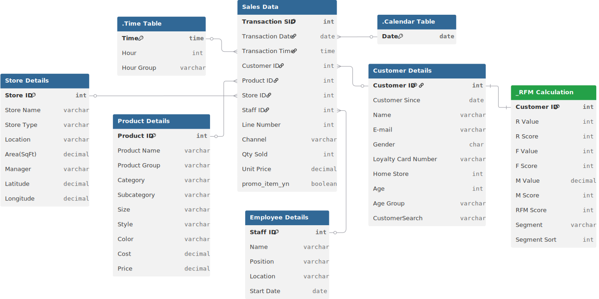

# 📊 Project Background: DailyBrew Advanced Retail Analytics

**DailyBrew** is a premier coffee and beverage enterprise based in New York, serving as a cornerstone of the city’s daily morning rituals. Since its establishment, the company has grown from a single artisanal cafe to a multi-location powerhouse across **Astoria, Hell’s Kitchen, and Lower Manhattan**. Over three years of collecting data, they were data-rich but insight-poor. As the brand prepares to scale further, the focus has shifted from "serving cups" to "optimizing customer lifetime value (CLV)."

This project leverages the high-velocity dataset of **907,000+ transaction lines** to dissect the mechanics of DailyBrew’s **$4.25 Million** annual revenue stream. As a Retail Data Analyst, my goal was to identify the "Silent Friction" in the morning rush and provide a blueprint for moving from a high-volume "Grab-and-Go" model to a high-margin "Loyalty-First" ecosystem.

Insights and recommendations are provided on the following key areas:

* **The Morning Velocity Crisis** (Managing the 7–10 AM Revenue Peak)
* **The Loyalty Gap** (Converting the "Non-Member" Majority)
* **The "Coffee-Plus" Attachment Rate** (Unlocking Revenue through Food Bundling)
* **Promotional Inefficiency** (The $30k Promo Paradox)

https://github.com/user-attachments/assets/a1cf94ee-6032-42e5-b0a3-5346bf150d7c

**PowerQuery M Code regarding data preparation process of various tables can be found [[here]](https://github.com/mehedibhai101/Advanced_End-to-End_Retail_Analytics/tree/main/Data%20Cleaning).**

**DAX queries regarding various analytical calculations can be found [[here]](https://github.com/mehedibhai101/Advanced_End-to-End_Retail_Analytics/tree/main/DAX%20Calculations).**

**An interactive Power BI dashboard used to report and explore analysis can be found [[here]](https://app.powerbi.com/view?r=eyJrIjoiYjRlM2U5ZmYtZmQyZS00MzE5LThjNzEtMjE5ZjQ2ZTQ3MTU1IiwidCI6IjAwMGY1Mjk5LWU2YTUtNDYxNi1hNTI4LWJjZTNlNGUyYjk4ZCIsImMiOjEwfQ%3D%3D).**

---

# 🏗️ Data Structure & Initial Checks

The DailyBrew analytics engine is built on a clean Star Schema, ensuring millisecond-level reporting across nearly **1 Million records**.

* **`fact_sales`:** The core table containing 907,841 line items, tracking `unit_price`, `quantity_sold`, and `promo_item_yn`.
* **`dim_products`:** Profiles 80+ SKUs across 9 categories (Coffee, Tea, Bakery, etc.) with detailed COGS and retail price data.
* **`dim_customers`:** A lookup of 2,200+ registered loyalty members, segmented by "Home Store" and "Birth Year."
* **`dim_stores`:** Granular data on the three primary retail hubs and one warehouse (Astoria, Hell's Kitchen, Lower Manhattan).
* **`dim_employees`:** Tracking performance for 40+ staff members across various positions (Baristas to Store Managers).

### 🗺️ Entity Relationship Diagram (ERD)


---

# 📋 Executive Summary

### Overview of Findings

DailyBrew is a high-performing operation with a total revenue of **$4.25M** and a healthy profit of **$3.11M**. However, the business is currently "Product-Heavy" but "Strategy-Light." Analysis reveals that **77% of transactions are single-category orders**, meaning customers are buying coffee but skipping the high-margin bakery items. Furthermore, **50.9% of total revenue** is generated by guest accounts (Non-Members), representing a massive missed opportunity for personalized marketing. While the "7–10 AM Rush" drives 35% of daily revenue, operational efficiency varies by store, with Hell's Kitchen showing a higher capacity for multi-item transactions.

---

# 🔍 Insights Deep Dive

### ⚡ The Morning Velocity Crisis

* **The 3-Hour Revenue Window.** 35% of total daily revenue is compressed into the **7 AM – 10 AM** window. This peak is remarkably consistent across all three Manhattan/Queens locations.
* **Store-Level Disparity.** While **Hell's Kitchen** and **Astoria** generate identical revenue (~$1.42M), Astoria requires 47% more transactions to reach that goal, indicating a lower AOV (Average Order Value).
* **Staffing Bottlenecks.** Revenue per staff member varies by as much as **300%**. Top-performing baristas (e.g., Staff ID 12) are significantly more efficient at upselling during peak hours compared to the store average.


### 🧲 The Loyalty Gap (The Membership Mirage)

* **The Non-Member Majority.** **50.9% of revenue ($2.16M)** comes from guest accounts (IDs 1000, 6000, 8600). These customers are currently "invisible" to our marketing efforts.
* **The AOV Lift.** Registered loyalty members have an **8% higher AOV ($640 vs $593)** than guest shoppers, proving that membership correlates with higher basket spending.
* **Dormant Data.** Over 40% of customers in the lookup table have not made a purchase in the last 6 months, suggesting a breakdown in the loyalty re-engagement cycle.


### ☕ The "Coffee-Plus" Attachment Rate

* **Single-Item Dominance.** Only **23% of transactions** involve more than one product category. The majority of customers are "Coffee-Only" or "Tea-Only."
* **The Bakery Opportunity.** Despite a high profit margin, **Bakery items** account for only **10.6% of total revenue**.
* **Missed Synergy.** There is a low correlation between "Whole Bean" sales and "Merchandise/Branded" sales, indicating that our most dedicated home-brewers are not buying our equipment.

### 🏷️ The Promotion Paradox

* **Underutilized Leverage.** Only **0.7% of total revenue ($29k)** is driven by promotional items. The sales uplift during promotional days is less than 3%.
* **Pricing Rigidity.** DailyBrew operates on a static pricing model. There is no evidence of dynamic "Happy Hour" pricing or bundle discounts being used to shift volume to off-peak hours.
* **Category Neglect.** "Drinking Chocolate" and "Flavours" have high profit margins but represent less than 12% of the mix, receiving almost zero promotional support.


---

# 🚀 Recommendations:

* **The "Morning Bundle" Pilot:** Launch a "Coffee + Pastry" discount strictly between **7 AM and 9 AM**. Target a shift from 23% to **35% multi-item transactions** to capitalize on the morning traffic.
* **The "Guest-to-Member" Blitz:** Implement an immediate POS prompt: *"Join Loyalty today for $1 off your current order."* Capturing just 20% of current guest revenue into the loyalty program would add **$400k+ to our "Known" database**.
* **Barista "Upsell" Training:** Use the "Staff Performance" data to have top-tier baristas (like Staff 12) train underperforming shifts in Astoria. Focus on "Bakery Attachment" techniques.
* **Dynamic "Off-Peak" Happy Hour:** To alleviate the 9 AM bottleneck, offer a **"10 AM – 12 PM" 15% discount** on Whole Beans and Branded Merchandise. This shifts labor demand and clears inventory.
* **Subscription Model for "Whole Bean" Buyers:** Since "Coffee Beans" generate $240k in revenue, launch a recurring monthly subscription for our **Brazilian - Organic** and **Espresso Roasts** to lock in recurring revenue.

---

## ⚠️ Assumptions and Caveats:

* **Customer Membership:** Customer IDs 1000, 6000, and 8600 are confirmed as "General Guest" accounts used by POS for non-members.
* **COGS Calculation Logic:** Profit margins were calculated using `current_cost` from the product table, assuming no significant variance in historical cost during the analyzed period.
* **Transaction SID:** For the lack of unique transaction id, transactions with identical `transaction_id`, `date`, `store_id` and `customer_id` are treated as a single transaction.

---

## 📂 Repository Structure

```
Advanced_End-to-End_Retial_Analytics/
│
├── Dashboard/                            # Final visualization and reporting outputs
│   ├── assets/                           # Visual elements used in reports (logos, icons, etc.)
│   │   ├── Icons/                        # Collection of icons used in KPI Cards/Buttons
│   │   │   ├── Button Icons/
│   │   │   │   ├── Navigation/
│   │   │   │   └── Others/
│   │   │   └── KPI Icons/
│   │   ├── logo.png                      # The brand logo of DailyBrew
│   │   └── Theme.json                    # Custom Power BI color palette for dashboard
│   ├── live_dashboard.md                 # Links to hosted Power BI Service report
│   └── static_overview.pdf               # Exported PDF version of the final dashboard for quick viewing
│
├── Data Cleaning/                        # Power Query M Codes for cleaning tables of the dataset.
│
├── Dataset/                              # The data foundation of the project
│   ├── entity_relationship_diagram.svg   # Visual map of table connections and cardinality
│   ├── Sales Data/
│   │   └── Sales by Store.csv
│   ├── Calendar.csv
│   ├── Customer Lookup.csv
│   ├── Employee Lookup.csv
│   ├── Product Lookup.csv
│   └── Store Lookup.csv
│
├── DAX Calculations/                     # Business logic and analytical formulas
│   ├── calculated_column.md              # Definitions for static row-level logic (e.g., hour buckets)
│   └── measures.md                       # Dynamic aggregation formulas (e.g., Total Revenue, MoM Growth)
│
├── LICENSE                               # Legal terms for code and data usage
└── README.md                             # Project background, summary and key insights
``` 

---

## 🛡️ License

This project is licensed under the [MIT License](LICENSE). You are free to use, modify, and distribute it with proper attribution.

---

## 🌟 About Me

Hi! I’m **Mehedi Hasan**, well known as **Mehedi Bhai**, a Certified Data Analyst with strong proficiency in *Excel*, *Power BI*, and *SQL*. I specialize in data visualization, transforming raw data into clear, meaningful insights that help businesses make impactful data-driven decisions.

Let’s connect:

[](https://www.linkedin.com/in/mehedi-hasan-b3370130a/)
[](https://youtube.com/@mehedibro101?si=huk7eZ05dOwHTs1-)
